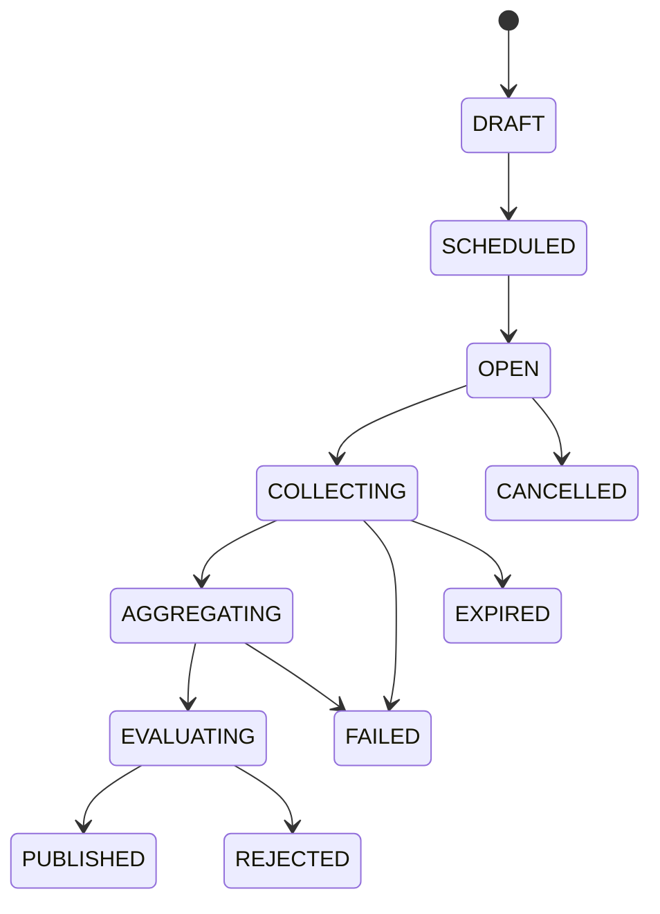
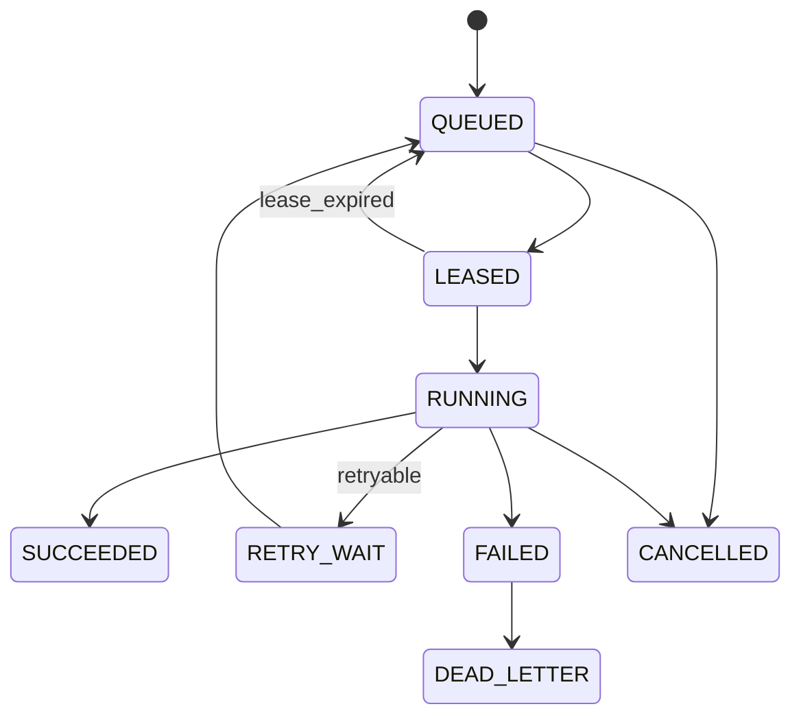

# Domain Model

Entities for the durable metadata store. IDs immutable; timestamps UTC.

## Core

| Entity | Purpose |
|--------|---------|
| Organization | Multi-tenant boundary |
| User / RoleBinding | Operator identity + RBAC |
| Federation / FederationMembership | Trust group of nodes/orgs |
| Node / NodeIdentity / NodeCredential | Participant machine + keys |
| NodeCapability / NodeHeartbeat | Scheduling inputs |
| DatasetAlias / DatasetPolicy | Local data handle without path disclosure |

## Training

| Entity | Purpose |
|--------|---------|
| Experiment / TrainingRun | Configured FL/LoRA effort |
| Round | State machine instance |
| ClientAssignment | Node ↔ round task |
| UpdateSubmission | Manifest + artifact ref |
| AggregationRun / EvaluationRun | Server-side steps |
| ModelManifest / AdapterManifest | Published artifact metadata |

## Jobs

| Entity | Purpose |
|--------|---------|
| Job / JobAttempt / JobLease / JobResult | Queue with retries |
| ValidationResult | Schema / canary / N-of-M |

## Governance

| Entity | Purpose |
|--------|---------|
| Artifact / ArtifactProvenance | Content-addressed bytes + lineage |
| AuditEvent | Append-oriented control events |
| ReputationSnapshot / RewardLedgerEntry | Durable incentives |

## State machines

Today’s code uses subsets (`OPEN/COLLECTING/AGGREGATING/CLOSED`, `QUEUED/ASSIGNED/COMPLETED/FAILED/CANCELLED`). Migrate names carefully with adapters.
