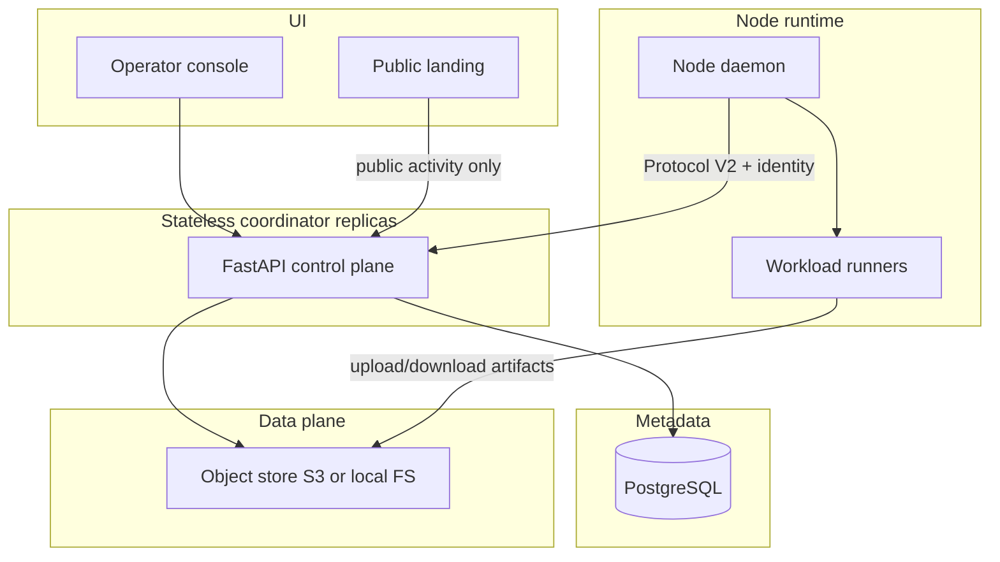

# Target Architecture

Evolutionary target for fed-compute. Preserve local JSON demo; introduce SQL + object store behind flags.

## Principles

1. **Control plane vs data plane** — metadata in SQL; large tensors as immutable hashed artifacts in object storage; typed HTTP for control.
2. **Stateless API** — no authoritative module globals; repositories + background reconcilers.
3. **Transitional compatibility** — `METADATA_BACKEND=json|postgres` (default `json`); legacy routes behind adapters; Protocol version negotiation.
4. **No network-supplied code execution** on coordinator; compute plugins allowlisted locally on nodes; later containers by digest.
5. **Truthful privacy** — privacy profiles on experiments/jobs; no unqualified “completely private.”

## Component boundaries

| Component | Responsibility |
|-----------|----------------|
| Coordinator API | AuthZ, state machines, scheduling, manifests |
| Repositories | Persist nodes, rounds, jobs, artifacts metadata |
| ArtifactStore | Put/get/verify by content hash |
| Aggregator workers | Off-request FedAvg / LoRA merge / eval |
| Node daemon | Identity, heartbeat, capabilities, local policy, launch runners |
| UI | Authoritative views; no fake production stats |

## Non-goals (near term)

- Blockchain / cryptocurrency rewards
- Custom unreviewed crypto protocols
- Rewriting working FedAvg math without tests
- Silent removal of JSON demo path
