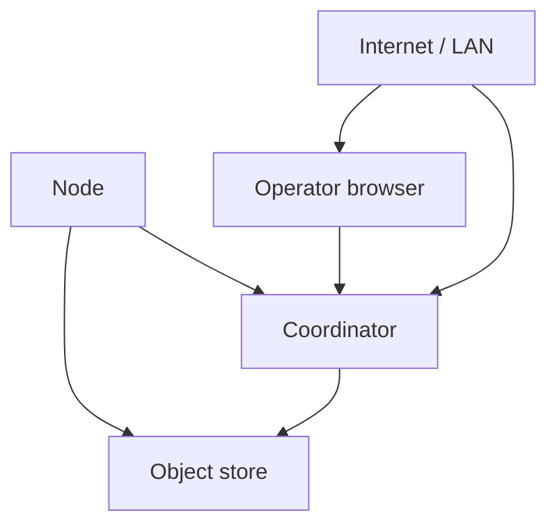

# Threat Model

## Trust boundaries

## Selected threats

| Threat | Assets | Likelihood | Impact | Existing | Required | Residual |
|--------|--------|------------|--------|----------|----------|----------|
| Stolen/guessed client name → key | Node auth | High | High | None (key re-issue) | Proof-of-possession register | Sybil still possible |
| Unset OPERATOR_API_KEY | Control plane | High in misconfig | Critical | Dev open | Fail-closed / run.sh default | Weak default key |
| Read `/jobs` anonymously | Prompts/results | High if public bind | High | None | Auth or redact | Metadata leakage |
| Oversized update JSON | Availability | Medium | High | Partial | Size limits + quotas | Slow loris |
| Malicious MODEL_MODULE | Node host | Medium if launcher | Critical | Operator gate | Allowlist modules | Compromised operator |
| Model poisoning | Global model | Medium | High | Shape/base checks | Robust agg + eval gates | Advanced attacks |
| Fabricated sample counts | Aggregation weight | High | Medium | None | Caps + trusted eval | Partial |
| Replay of submissions | Integrity | Medium | Medium | None | Nonces / idempotency | — |
| Gradient inversion | Privacy | Research-dependent | High | Data locality only | DP / SecAgg optional | Always residual |
| Location re-id | Participants | Low–Med | Med | Jitter + city | Disable geo; k-anonymity | Small fleets |
| Plugin escape | Host | Med | Critical | Allowlist import | Containers / no network | Kernel bugs |
| Path traversal in archives | Host | Low today | High | N/A uploads | Validate extracts | — |
| SSRF via geo/url | Coord | Low | Med | Fixed ip-api host | Block private SSRF | — |
| Reward manipulation | Ledger | Med | Med | Simple counters | Verified work only | Economic attacks |
| Dependency compromise | Supply chain | Low | Critical | Unpinned CI | Pin + SBOM + scan | Always residual |

## UI / docs communication

- Never claim FL = complete privacy
- Show worker trust class for inference
- Label demo vs production stats
- Disclose location collection and how to disable (`GEO_LOOKUP_DISABLED`)
