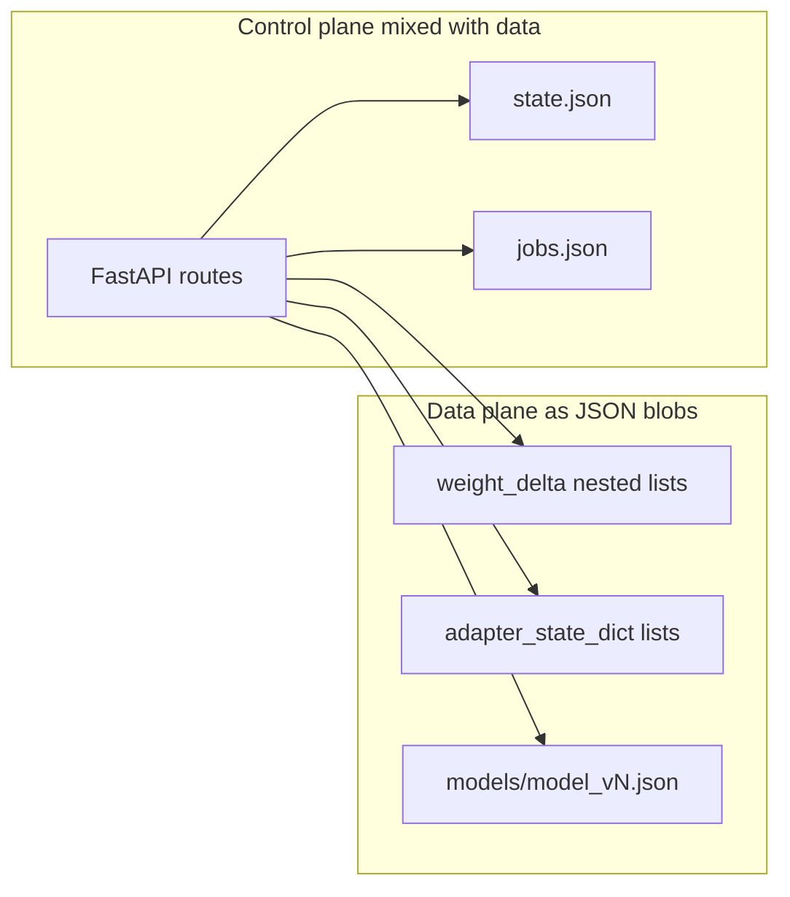

# Current State Audit

**Date:** 2026-07-18  
**Baseline:** `pytest tests/ -q` → 13 passed; `cd ui && npm run build` → pass  
**Source of truth:** checked-out source, not marketing docs

## Product as implemented

fed-compute (open-federated-trainer) is a **multi-workload federated compute coordinator**: classic FedAvg training, LoRA/PEFT rounds, a durable job queue (inference / label / allowlisted compute), reputation/incentives, a React operator console, and a public landing page with a privacy-fuzzed activity globe.

Public promise: *Private data. Shared progress.*  
Positioning: *The open coordination layer for distributed intelligence.*

## What is production-worthy today

| Area | Evidence | Notes |
|------|----------|-------|
| FedAvg with shared base weights | `coordinator/src/core/aggregator.py` | Rejects mismatched bases / architectures |
| Job queue durability | `coordinator/src/jobs/` → `data/jobs.json` | Survives restart; size limits on payload/result |
| LoRA round durability | `rounds/create_round.py` → `data/lora_rounds.json` | Submissions persist |
| Client API keys | `AuthManager` + `StateStore` | Persisted in `data/state.json` |
| Compute plugin allowlist | `client/src/jobs/_load_compute_plugin` | Empty allowlist refuses execution |
| Dataset hard-fail | `private_datasets/` unless `ALLOW_SYNTHETIC_DATA` | Opt-in synthetic only |
| Operator mutations via header | `X-Operator-Key` + `_require_operator` | When `OPERATOR_API_KEY` is set |
| Anonymized activity map | `geo_presence.py` + `/dashboard/activity` | City-level + jitter; no IDs/IPs in API |
| UI operator UX | confirmations, Settings key, truthful round states | After UI/UX hardening |

## What is prototype-only

| Area | Evidence | Impact |
|------|----------|--------|
| Classic rounds / assignments | `RoundManager` memory; only clients + `next_round_id` restored | Restart loses open rounds |
| Reputation / incentives | In-memory managers | Lost on restart |
| Nested JSON tensors | Updates and adapters as `List[List[float]]` | DoS, bandwidth, no hash integrity |
| Operator open-if-unset | `validate_operator_key` returns True | Unauthenticated control plane |
| Open registration key re-issue | `AuthManager.register_client` | Credential theft by name |
| Unauthenticated ops reads | `/dashboard/overview`, `/jobs` | Payload/result leakage |
| Local launcher | `subprocess.Popen` of clients | Host RCE if operator key weak |
| No CI | No `.github/workflows` | No continuous gates |
| No secure aggregation / DP | Absent | Privacy claims must be qualified |
| No horizontal scale | Process globals | Sticky single process |

## Control plane vs data plane (today)

Large tensors travel as HTTP JSON. There is no object-store abstraction, no content-addressed binary artifacts, and no Protocol V2 manifests.

## Route auth summary

| Class | Examples |
|-------|----------|
| Public | `/health`, `/dashboard/activity`, `/dashboard/overview`, `/jobs`, `/model/{v}`, metrics, reputation |
| Node (API key) | `/task/{id}`, `/update`, LoRA submit, job claim/result |
| Operator | aggregate, create LoRA round, set model, create/cancel job, launch |

## State durability matrix

| Survives restart | Does not |
|------------------|----------|
| Client keys, client ids, next_round_id, pending update blobs | Classic Round objects, assignments |
| Models/, adapters/, jobs.json, lora_rounds.json, geo_presence | Reputation, incentives, rate limits, launcher table |

## Tests / CI

- Python: `tests/test_fedavg.py`, `tests/test_production_workloads.py` (13 tests)
- Shell integration scripts under `tests/integration/` (likely stale vs `DATASET_PATH`)
- UI: typecheck + Vite build only; no unit/e2e/a11y tests
- CI: none

## Ranking snapshot

See sibling audit docs for full P0–P3 findings. Highest blockers for production use: registration key theft, open operator mode, unauthenticated job/overview reads, non-durable classic rounds, JSON tensor DoS path without update size limits (size limit is a Milestone 0 fix).
